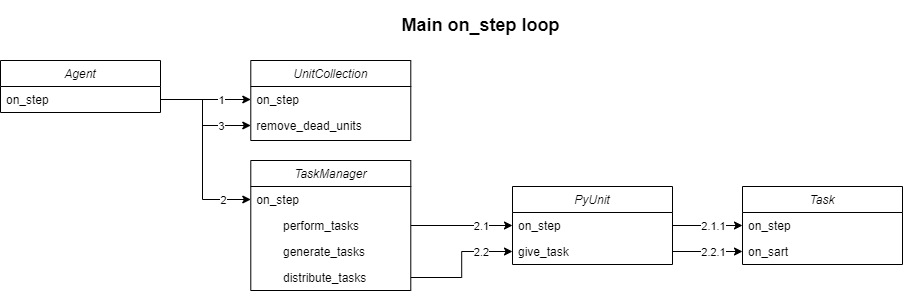
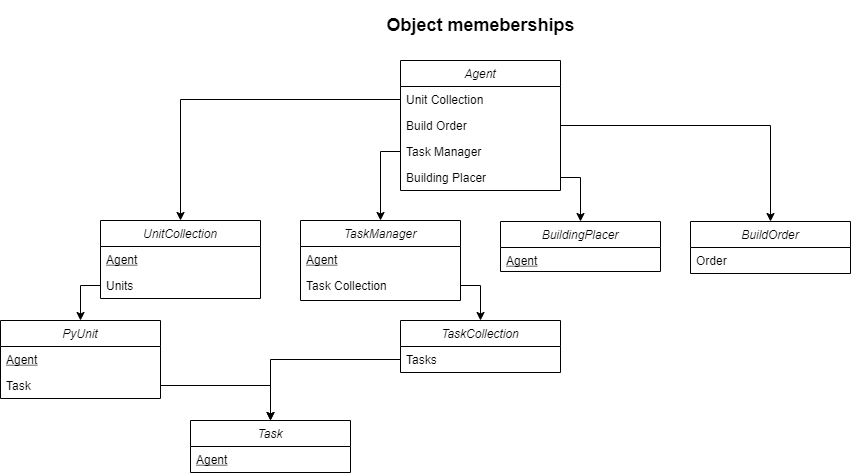

# PyCommandCenter-bot

This project serves as a basic bot for playing StarCraft II (SC2), a code skeleton that can be used to further 
develop an intelligent agent.

The bot is written using the [PyCommandCenter API](https://gitlab.liu.se/starcraft-ai-course/pycommandcenter).
For more insight on how to use the API, see its 
[documentation](https://starcraft-ai-course.gitlab-pages.liu.se/pycommandcenter/index.html).

## Set-up and running the bot

You need to have the PyCommandCenter library in the root directory of your project. This is covered in the 
[lab instructions](https://gitlab.liu.se/tddd92/tddd92-lab-instructions/-/wikis/installationsinstruktioner) for the 
course TDDD92.

To run the agent you need to create a file `config.py`. **It needs to include the SC2-path that is specific to your 
computer.** It should also contain some customizable booleans for debugging, and other config variables. You solve 
this by copying `_config.py`, renaming the copy, and modifying it as needed.

Once you have your config file set up, simply run `main.py` to launch SC2.

*Tip: The config file includes several ways for you to debug and test your bot.*

## How the bot works

This bot works by creating tasks and distributing them to units that can perform them.

### Main loop

The main loop of the agent consists of
* adding and updating units in the agent's internal unit collection,
* performing all tasks currently assigned to units,
* generating and queueing new tasks, and
* distributing queued tasks.

#### StarCraft and IDABot

In the beginning of each step, PyCommandCenter observes the SC2 game state and creates data from the 
observation. 

After these observations, the bot's on_step function runs.
Any actions affecting SC2 are queued up, the results of these actions are not observed until the next step.

The last thing that happens each step is that all queued actions are performed in SC2.

#### Agent

The main loop functionality of the agent is in the on_step function in `basic_agent.py`.
It consists of three major parts:

* Updating all known units
* Performing, generating, and distributing tasks
* Removing dead units

#### UnitCollection
All units in the bot needs to be up to date. Enemy and neutral units that leave the vision of the bot is removed 
from the unit collection. (The unit's id will not be the same if the same unit reappears in vision). 

At the end of a step all units that are dead are removed.

#### TaskManager
The TaskManager handles the evaluation, generation, and distribution of tasks.

The TaskManager will call every unit's on_step. Then task are generated for every base, building, attack, and more. 
Lastly the TaskManager distributes tasks to units. If the new task has a higher priority then a task that a 
unit is preforming the TaskManager will give the new task to the unit and put the old task back in the task queue.

#### PyUnit
When a PyUnit on_step is called, it will call its task's on_step and return the status code from the task to the 
TaskManager.

#### Task
The task's on_step will check if the unit is doing the correct task and if the task is completed.
Some tasks also send actions to SC2.

#### The story of Bob - The brave SCV

When a unit is created, we can call him Bob, the bot will give Bob the Idle task. The next time the bot runs the 
perform_tasks method, Bob's task will be completed (because it's an Idle task) and the task will return Status.DONE. 
Bob will then receive a new Idle task. The TaskManager will generate new tasks, for example a GatherMinerals task. 
Because Bob is idle he will receive the new action when tasks are distributed. Bob will run the on_start method of 
the task, he will right-click on the mineral field. In the next performs_tasks method call, Bob will check if he is 
still gathering minerals. If he is, the task will return Status.NOT_DONE. If he is not, the task will return 
Status.FAIL. 

Now the TaskManager generates a Build task, we need a Supply Depot. There are no idle units and the Build task is 
higher priority than the GatherMinerals task, so Bob is reassigned to build instead of mine.
When Bob receives his new task, the old GatherMinerals task is re-added to the task queue for someone else to continue
later. On his way to build a Supply Depot, Bob is tragically killed. He returns Status.FAIL_DEAD the next time the
perform_tasks method is called.

The Build task is re-added to the task queue, and assigned to Bob's cousin Alice the next time tasks are distributed. 
Alice runs the task's on_start, but since it was already started by Bob it instead checks if the old build
position is still valid. It's not, so a new build position is found and Alice gets to work.

### Classes

The image below shows the relationship between the different objects used by the bot.
The arrows indicate that an object has another object as a member.
Most classes have a reference back to the agent object in order to have access to all necessary information.

#### Agent

The agent is the coordinator between the different modules.

#### UnitCollection

The UnitCollection creates and handles the updates between SC2 units and PyUnits. It also has a group 
system, where PyUnits can be assigned to a group with a key. The get_group function is useful to get the PyUnits 
that match multiple conditions, but it can be slow if used suboptimally.

#### BuildOrder

The BuildOrder is a list of units that the bot should create. The BuildOrder is not smart. If the bot can't build a 
building it will wait until it can. So make sure that the prerequisite for buildings is in the build order. Workers 
are always created and do not need to be in the build order.

Build orders can be defined in the `builds` folder. Every line in the file is one or more units/upgrades that 
should be built. A line can begin with any numbers, since they will be ignored (build orders from 
[spawningtool](https://lotv.spawningtool.com/) include supply and timestamps). Then a unit/upgrade type id 
followed by x and an integer representing the quantity of units that should be created. For example,

    19  1:27  Orbital Command, Reaper x3

will ignore "19  1:27", then create an Orbital Command and 3 Reapers.
Build orders can easily be found and copied from [spawningtool](https://lotv.spawningtool.com/).

#### PyBuildingPlacer

The PyBuildingPlacer uses PyCommandsCenter's building placer to find position to place buildings. 

#### TaskManager

The TaskManager handles tasks. It has a task queue with tasks that should be done and tasks that are generated are 
added to the task queue. 

Tasks are distributed to units in order of priority. *Note: priority 0 is the highest priority.*

#### PyUnit
A PyUnit contains all the information and have all the functions that a PyCommandCenter unit has.
The PyUnit also contains extra information and functionality, e.g. for running tasks.

#### Task
Every type of task is a subclass of the base class *Task*. 
A task has four methods that control how a task is preformed in SC2. 

* **\_\_init__** should set up which units that can preform the task, the task's priority, and 
  information needed to preform the task. For example, Build's \_\_init__ also sets what type of
  building the task should build and where. 

* **on_start** should check if the task can be started by the unit, and begin executing the task if it can.
  For example, Build's on_start should check if the bot can build the building at the chosen position. 
  If it can, the unit starts to build the building. The on_start 
  function should also be able to continue an already started but interrupted task.
  
* **on_step** should check if the task has failed and preformed action in SC2 if needed.

* **on_fail** should try to repair the task, so it can be restarted, or find out why it failed.

Tasks use status codes to communicate with PyUnit and TaskManager. How these are used vary somewhat depending on the
task. For example, knowing why a task has failed can be important in some tasks, and not so important
in others. 

One of the available tasks in BasicAgent is the 
[GatherGas](https://github.com/realcraft-ai/PyCommandCenter-bot/blob/BasicAgent/tasks/gather_gas.py) task. It's easy
to start with to get an overlook of the basic structure of the tasks. The on_start-function right-clicks the target 
refinery. The on_step-function checks if unit is idle which means that it has stopped gathering gas. It also checks
that there's still gas to gather from the refinery. In this task there are no reason to handle fails in a specific 
way, so the on_fail-function is excluded (only Build task has an implemented on_fail).

#### Logger

Can create a log file. It is useful for visualizing how the bot is progressing and how it uses its time and resources.
It saves information in a csv file format.

#### TicToc

A class that can be used similar to MATLAB's tic toc. It is useful to use when checking how the time is used in a 
tick.

## Visual debugger

There is a visual debugger that can be helpful to use if you want to draw information in a separate window.
Details on how to use the visual debugger can be found [here](visualdebugger/README.md).

## Known bugs

Henceforth, we describe bugs that are of the know variety.

### Morph

The Morph task is only implemented to support upgrading buildings (e.g. Command Center to Orbital Command), so adding 
morphed units (e.g. Supply Depot Lowered) to the build order will result in unexpected behaviour.
The list of producers from the API includes morphed versions of the same unit, which causes the task to choose
those for Morph tasks (e.g. choosing a Supply Depot Lowered to produce a Supply Depot).

### Refinery workers
Sometimes, a refinery has more workers gathering gas than it should. For instance, there might be three GatherGas tasks 
targeting a specific refinery, but four workers are gathering gas there.
